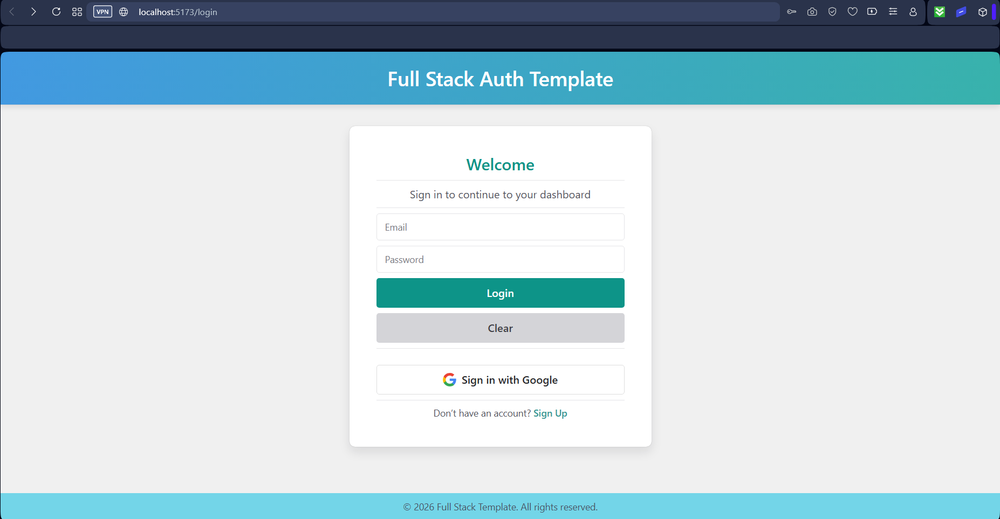

# Full Stack Template


---

## Overview

A scalable full-stack template with FastAPI backend and React frontend, designed for multiple user roles, supporting both email+password and Google (OAuth2) login, async operations, and JWT authentication.

---

## 🖼️ Demo / Screenshot

Here’s what the login page looks like:



---

## 🛠️ Stack

- **Backend:** FastAPI, SQLAlchemy (async), Alembic migrations  
- **Authentication:** Email + Password (with JWT access & refresh tokens), Google OAuth2 
- **Frontend:** React + Vite, Chakra UI
- **State Management:** Redux (main app state) 
- **Database:** PostgreSQL (async)  
- **Caching & Tasks:** Redis + Taskiq (async task queue)
- **Deployment:** Docker

---

## 📥 Installation

### 1. **Clone the repository**
```bash
git clone https://github.com/Nachiket-2024/full_stack_template.git
cd full_stack_template
```

### 2. **Set up the environment** (only if running locally; skip if using Docker)
> Instructions below assume that you are at the root of the repository while running the commands.
- Install Backend dependencies with pip:

```bash
cd backend
pip install -r requirements.txt
```

- Install Frontend dependencies:

```bash
cd frontend
npm install
```
---

## ⚙️ Environment Variables

All environment variables are defined in `.env.example`.  
Copy it to `.env` and update the values with your own credentials:

```bash
cp .env.example .env
```
---

## 🚀 Run the App
> Instructions below assume that you are at the root of the repository while running the commands.

> Configure your Google Cloud project and enable the Oauth API before use.

### Path 1. **Docker (Recommended Way)**
```bash
docker compose up
```
Once the services are running:

- **Backend:** [http://localhost:8000/docs](http://localhost:8000/docs) – FastAPI API docs and endpoints  
- **Frontend:** [http://localhost:5173](http://localhost:5173) – React + Vite frontend  
- **PostgreSQL:** `localhost:5432` – Database ready for connections  
- **Redis:** `localhost:6379` – Cache and Taskiq broker  
- **Taskiq worker:** Automatically listens for async tasks and queues
- **Alembic migrations:** Run automatically on container startup, ensures DB schema is up to date

---
### Path 2. **Running the App Locally**

> Make sure PostgreSQL is running locally and the database exists. 
> Redis can be run locally or via Docker.

#### 1. Run Alembic Migrations (ensure DB schema is up to date)

```bash
cd backend
alembic upgrade head
```

- **Alembic migrations:** Ensures that the local database schema matches the latest migrations.

#### 2. Start the FastAPI backend

```bash
uvicorn backend.app.main:app --reload
```

Once the services are running:

- **Backend:** [http://localhost:8000/docs](http://localhost:8000/docs) – FastAPI API docs and endpoints
- **PostgreSQL:** `localhost:5432` – Database ready for connections  
- **Redis:** `localhost:6379` – Cache and Taskiq broker  

#### 3. Start Taskiq Worker (for async tasks)

```bash
taskiq worker backend.app.taskiq_tasks.email_tasks:broker --reload
```

- **Taskiq worker:** Listens automatically for async tasks and queues

#### 4. Run the React frontend

```bash
cd frontend
npm run dev
```
- **Frontend:** [http://localhost:5173](http://localhost:5173) – React + Vite frontend  

---

## 📝 Notes

- All credentials and secrets are loaded from `.env`  
- **Alembic** is used for database migrations  
- **Redis + Taskiq** are used for async tasks and caching  
- Security features include IP rate limiting and brute-force attack prevention integrated in Auth and OAuth flow
- OAuth2 setup requires Google credentials  
- JWT access and refresh tokens are handled in auth folder with modular files for clarity 
- Redux manages global app state 

---

## 📄 License
This project is licensed under the MIT License - see the [LICENSE](LICENSE) file for details.

---